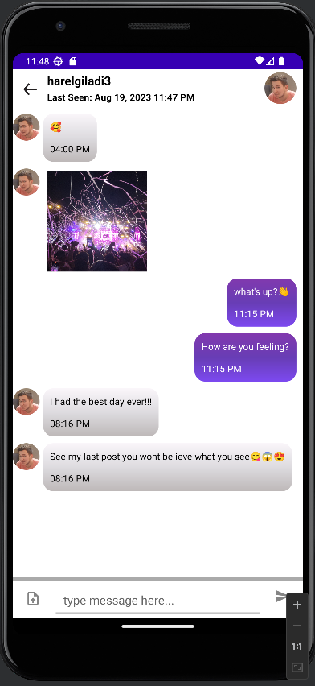

  
  <h1>🍴 Frontend Delights: A Culinary Adventure with InstaFoodies 📸</h1>
  
Welcome to the enchanting realm of InstaFoodies' frontend, where the art of cooking converges with the magic of social connection! 

---

## Table of Contents

- [Introduction](#-introduction)
- [System Overview](#-system-overview)
- [System Architecture](#system-architecture)
  - [Architectural Design](#-architectural-design)
- [Decomposed Modules](#decomposed-modules)
  - [User Authentication and Registration](#user-authentication-and-registration)
  - [Post Creation and Editing](#post-creation-and-editing)
  - [Feed Display and Navigation](#feed-display-and-navigation)
  - [User Profile and Settings](#user-profile-and-settings)
  - [Search Functionality](#search-functionality)
  - [Notifications](#notifications)
  - [Chat Messaging](#chat-messaging)
  - [Content Recognition and Reporting](#content-recognition-and-reporting)
  - [Recipe Web Scraping and Integration](#recipe-web-scraping-and-integration)
- [Human Interface Design](#human-interface-design)
- [License](#-license)

---

## 📑 Introduction

## Discover Flavorful Frontend Adventures

Step into a world where recipes become stories and culinary creativity knows no bounds. InstaFoodies' frontend is your portal to a vibrant community of food enthusiasts, where each screen and interaction is designed to elevate your culinary journey. 🍳🎨👨‍🍳👩‍🍳

## Savory Features at Your Fingertips

Craft, share, and savor the magic of cooking with ease. Unleash your inner chef with the "Post Creation and Editing" module, elegantly blending images, descriptions, and instructions. Forge connections with like-minded food lovers using the intuitive "Chat Messaging" component. 💬📝

## A Fusion of Design and Passion

Every pixel of InstaFoodies' frontend is a labor of love, catering to your craving for both aesthetic pleasure and seamless functionality. Whether you're discovering global flavors or sharing your culinary creations, our UI promises an experience as delightful as your favorite dish. 🧡🎨

## Embark on Your Culinary Odyssey

Get ready to immerse yourself in a world where recipes come to life and friendships are forged over shared flavors. InstaFoodies' frontend is your gateway to a culinary adventure that marries the art of cooking with the joy of connection.

Fire up your creativity, ignite your taste buds, and embark on a journey where food, fun, and friendship meet in perfect harmony.

Bon appétit and bon voyage! 🍽️🌍

---

## 📋 System Overview

InstaFoodies UI is the captivating facade of our dynamic recipe-sharing application, an innovative social media platform designed for users to effortlessly share and explore new culinary creations. Our users can craft and edit recipe posts, follow other culinary aficionados, embark on a culinary journey through a diverse recipe repertoire, and stay informed through real-time notifications. The UI boasts a sleek and intuitive design to ensure an immersive and engaging experience. 📸👨‍🍳🌟

---

## System Architecture

### 📱 Architectural Design

Our UI is architected using the Model-View-ViewModel (MVVM) design pattern, a cornerstone for maintainable and scalable app development. The MVVM pattern empowers us with:

- **Model:** Expertly handles data logic and facilitates communication with the backend.
- **View:** Artfully crafts the Android UI, utilizing layouts and user interface components.
- **ViewModel:** Seamlessly orchestrates data preparation for the UI and encapsulates UI-centric logic. 🏛️🛠️

## Decomposed Modules

Our UI is meticulously divided into a symphony of modules, each finely tuned to orchestrate a specific realm of functionality:

### User Authentication and Registration

- Component: `Login` 🔐
- Responsibilities: Expertly handles user registration and authentication, prioritizing security and seamless user experience.

### Post Creation and Editing

- Component: `Post` 📝
- Responsibilities: Empowers users to sculpt and refine their culinary masterpieces, effortlessly intertwining captivating images with descriptive narratives.

### Feed Display and Navigation

- Component: `Feed` 🍔
- Responsibilities: Transforms your feed into a culinary odyssey, elegantly showcasing posts, likes, comments, and shares.

### User Profile and Settings

- Component: `Profile` 👤
- Responsibilities: Elevates personalization by furnishing users with a canvas to curate their profiles, tantalizingly painting their culinary identity.

### Search Functionality

- Component: `Search` 🔍
- Responsibilities: Unleashes the power of exploration, offering users a portal to discover fellow food enthusiasts and delectable recipes.

### Notifications

- Component: `Notifications` 🔔
- Responsibilities: Elevates interaction with real-time notifications, seamlessly connecting users to their culinary community.

### Chat Messaging

- Component: `Chat` 💬
- Responsibilities: Facilitates engaging and real-time conversations, sating the appetite for connection.

### Content Recognition and Reporting

- Component: `ContentRecognition` 🕵️
- Responsibilities: Safeguards the platform's integrity by leveraging AI to identify and address potential content violations.

### Recipe Web Scraping and Integration

- Component: `Scraping` 📚
- Responsibilities: Bridges the culinary divide by ingeniously integrating external recipes, inspiring creativity without leaving the app.

  ---

## Human Interface Design

Our UI is a canvas of user-centric design, harmoniously merging aesthetics and functionality to craft an unparalleled experience.

Key screens include:

## Table of Contents

| Login | Feed | Profile |
| :---: | :---: | :---: |
|  |  |  |

| Post | Networking | Chat |
| :---: | :---: | :---: |
|  |  |  |

| Chat Requests | Search | Upload & Update |
| :---: | :---: | :---: |
|  |  |  |

| Notifications | Scraping | Register |
| :---: | :---: | :---: |
|  |  |  |

For a comprehensive tour of each module's symphony, meticulously composed to serenade your culinary senses,

please navigate to the [Decomposed Modules](#decomposed-modules) section above. 🎨📱

---

## 📜 License

InstaFoodies UI is proudly crafted under the umbrella of the [MIT License](https://opensource.org/licenses/MIT). This sacred culinary masterpiece is open for you to savor, modify, and distribute, while honoring the terms of the license.

Embark on a gastronomic odyssey with us at InstaFoodies, where the joy of cooking meets the power of social connection! 🍳📸🥗

